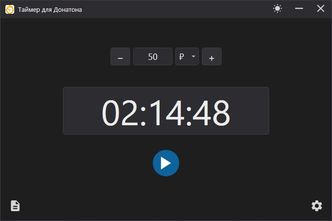
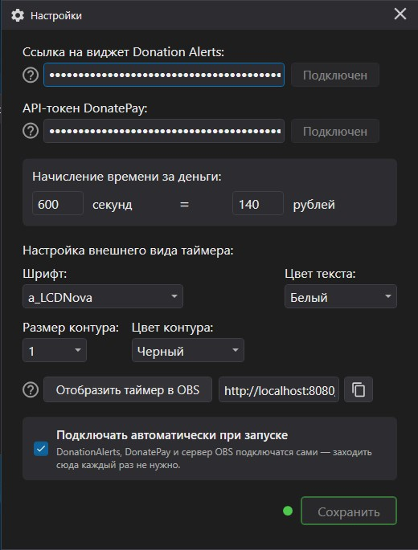
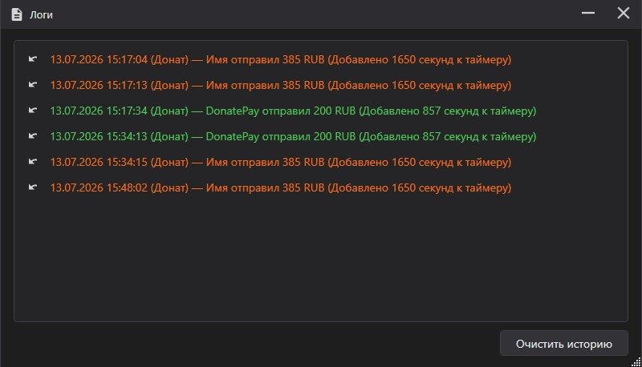

# Timer for Donaton
Timer for Donaton — это приложение, разработанное для проведения донатонов. Оно отслеживает донаты с **DonationAlerts** и **DonatePay**, автоматически добавляет время в таймер в зависимости от суммы доната и помогает стримерам управлять своими марафонами.

## 📋 Функциональность
- 🔔 **Отслеживание донатов:** интеграция с DonationAlerts и DonatePay одновременно.
- ⚙ **Автоматический расчет:** каждая сумма доната добавляет соответствующее количество времени в таймер.
- 🕒 **Настройка времени и правил:** возможность задать формат и правила добавления времени.
- ⏱️ **Точный таймер:** отсчёт привязан к монотонным часам и не накапливает ошибку даже за многодневные марафоны.
- ↩️ **История и откат:** лог всех донатов; начисленное время можно откатить и вернуть обратно одной кнопкой.
- 🌗 **Тёмная и светлая темы** оформления.
- 🖥️ **Вывод в OBS:** текущее время передаётся по локальному WebSocket.

## 🖼️ Скриншоты

## 🛠️ Установка
1. Перейдите на вкладку **Releases** в этом репозитории и скачайте последнюю версию приложения:
[Скачать релиз](https://github.com/Rep1ie/Timer-for-Donaton/releases).
2. Распакуйте загруженный `.zip` архив в любое удобное место на компьютере.
3. Запустите `Timer for Donaton.exe`.

💡 *Убедитесь, что на вашем компьютере установлен .NET Framework 4.8 или выше.*

## 🔗 Интеграция с сервисами
Приложение поддерживает два сервиса — можно подключить любой из них или оба сразу.

### DonationAlerts
1. Зайдите в ваш аккаунт на [Donation Alerts](https://www.donationalerts.com/).
2. Откройте вкладку **Виджеты** → **Оповещения** в боковой панели.
3. Скопируйте **ссылку на виджет оповещений**.
4. Вставьте эту ссылку в текстовое поле настроек внутри приложения.

### DonatePay
1. Зайдите в свой аккаунт на [DonatePay](https://donatepay.ru/).
2. Откройте страницу [API](https://donatepay.ru/page/api) и скопируйте ваш **API-токен**.
3. Вставьте токен в соответствующее поле настроек внутри приложения.

После этого задайте курс (сколько времени добавлять за сумму) — и приложение начнёт отслеживать донаты и добавлять время на основе ваших правил.

---

## 📜 История изменений
Полный список изменений — в [CHANGELOG.md](CHANGELOG.md).

## 🌟 Вклад
Буду рад любым предложениям по улучшению! Вы можете создать `Issue` или `Pull Request` в этом репозитории.
